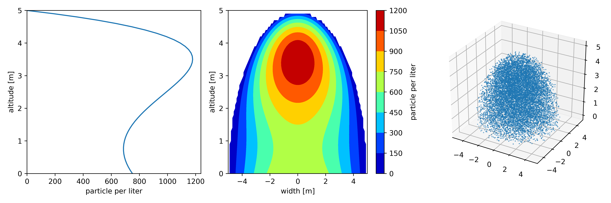

# Dust Bubble

## Modeling of an idealized particle plume

This Repository is about the definition of an idealized particle plume.
Here I focus on a forced emission process like particles that whirled up by a vehicle from a dry, dusty surface.

The concrete example used here is about the spreading of dry fertilizer and the tilling with a plow afterward.

### Method

The Particle plume was observed with 2 aerosol monitors, which measured the particle number concentration in 31 size bins from 0.25 &mu;m  - 32 &mu;m in two different heights.
From this, a vertical profile of particle concentration is assumed (c.f. Fig).

I define the profile as the center of the plume and multiply it with an ellipsoid to get a bubble-shaped concentration field.
Based on this, the single-particle positions were generated.

A detailed description of the algorithm can be found in the file  [dust-bubble.ipynb](dust-bubble.ipynb)

### Application

The particle positions are used as start points for the Lagrangian particle dispersion model *[Itpas](https://zenodo.org/record/3932248)*.

This software is part of the *Itpas* pre-processing.
The particle start points can be written into the start file format of *Itpas*.  
<!-- Details on the particle model and its application can be found (later) at Faust et al. (in Prep.) -->

### Requirements
The code is written in python3 as Jupyter Notebook([dust-bubble.ipynb](dust-bubble.ipynb)). A copy of the code as python script ([dust-bubble.py](dust-bubble.py)) is included but will be updated only for the release-versions.

Following packages are used:
- numpy
- matplotlib
- mpl_toolkits

### Citation
Please cite this software as suggested by Zenodo on the right.
